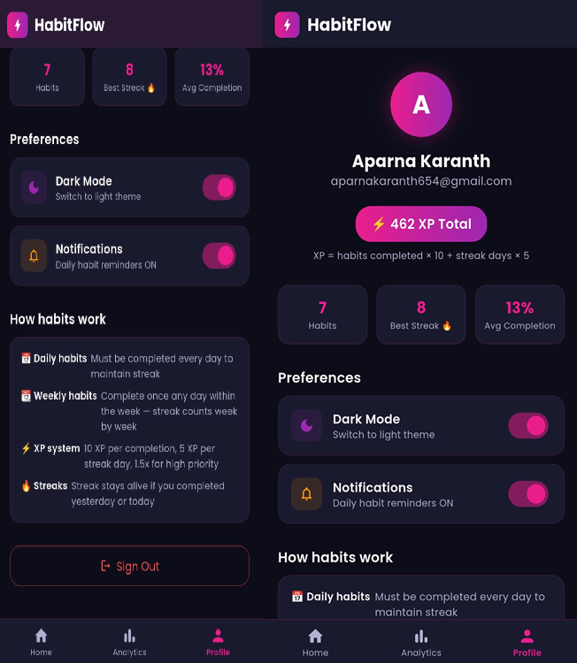
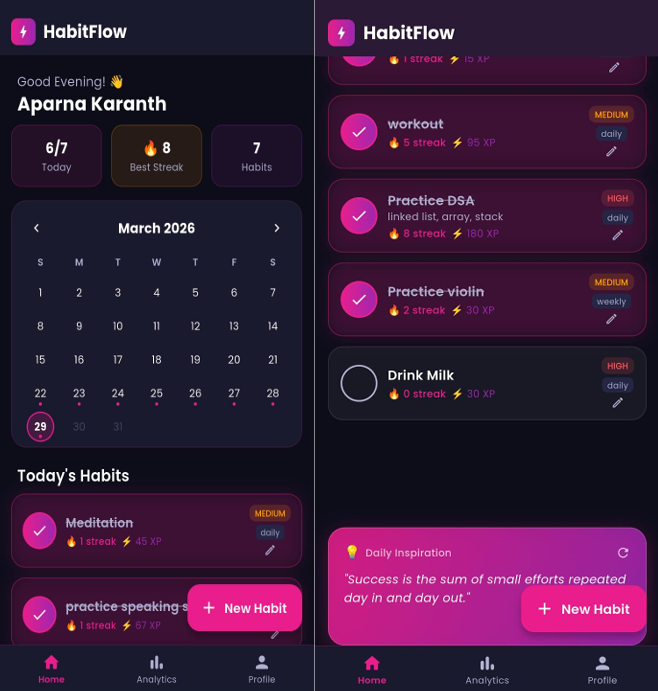
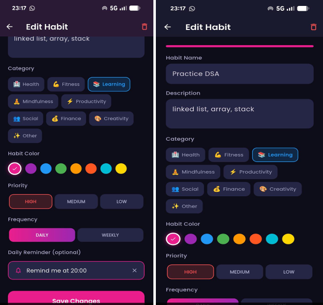
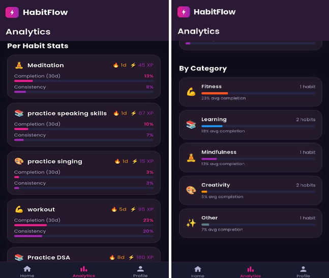
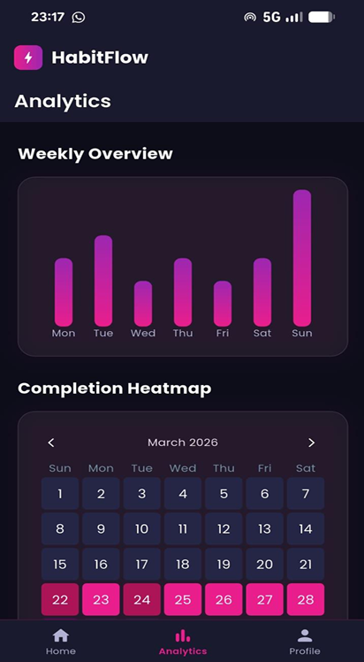

# HabitFlow

HabitFlow is a high-performance cross-platform productivity engine designed to bridge the gap between behavioral psychology and software engineering. Built on the Flutter framework, the application utilizes a single Dart codebase to deliver a responsive experience across Android, iOS, and Web environments. 

The application is engineered around established behavioral cue-routine-reward loops, implementing gamified experience design, multi-metric analytical tracking, and seamless background data synchronization to optimize long-term user consistency.

---

## Key Features

### Authentication Pipeline
* Secure registration and login infrastructure driven by Firebase Authentication.
* Integrated Google OAuth sign-in flows alongside standard email and password authentication providers.

### Personalization and Management
* Granular habit creation interface supporting priorities (High, Medium, Low), frequencies (Daily or Weekly), custom category taxonomies, and distinct color indicators.
* Comprehensive onboarding library containing over 25 pre-configured habit templates across 8 behavioral disciplines.

### Tracking and Inline Calendar
* Dynamic single-tap habit completion updates with immediate client-side and server-side state transitions.
* Interactive home dashboard calendar featuring color-coded indicator dots (pink for partial, green for complete) and retrospective day-level log inspection.

### Behavioral Gamification
* Real-time XP (Experience Points) accumulation algorithm scaling with habit priority tiers and consecutive streaks.
* Automated badge tier processing triggering immediately upon completion of behavioral milestones.
* Micro-rewards using custom multi-layered confetti explosion particle animations on the presentation layer.

### Architectural Analytics
* Time-series dashboard tracking 7-day completion density via interactive bar charts.
* Complete calendar heatmap visualizations providing long-term structural visibility into behavior adherence.
* Computed granular habit metrics detailing strict completion percentages and weighted consistency scores.

### System Infrastructure
* Local notification management orchestrating scheduled, per-habit reminders operating independently of live app states.
* Offline capability backed by Cloud Firestore caching layers ensuring transparent data synchronization upon connection re-establishment.
* Persistent state theme management (Dark and Light modes) using client-side key-value shared preferences.

---

## User Interface Screenshots

### Authentication Interface
The secure entry pipeline supporting dual-provider authorization options.

### Home Dashboard
The central execution interface containing structural progress summaries, the inline tracking calendar, and the active task checklist.

### Habit Optimization and Setup
The customization screen allowing deep profiling of individual behavioral parameters, notification alerts, and category color tagging.

### Curated Habit Blueprints
The onboarding template engine allowing instant initialization of standardized developmental routines.

### Analytical Pipeline and Progress Metrics
Data processing layouts rendering the 7-day performance bar chart, monthly adherence heatmaps, and category breakdowns.

---

## Architecture and Technical Stack

HabitFlow strictly follows a decoupled three-layer clean software architecture to separate system concerns and promote maintainable extension pipelines:

1. **Presentation Layer:** State-isolated Flutter widgets and custom layout interfaces optimized for multi-platform responsiveness.
2. **Business Logic Layer:** Managed state management providers mediating data distribution between UI listeners and background repositories. Handles computed operations including live streak tracking and priority multipliers.
3. **Data Layer:** Abstracted network and local storage services interface directly with external persistence layers (Firebase Firestore SDK and SharedPreferences).

### Technology Inventory
* **UI Framework:** Flutter and Dart SDK
* **State Management:** Riverpod 
* **Backend Database:** Cloud Firestore (NoSQL Document Store)
* **Identity Management:** Firebase Authentication / Google OAuth
* **Data Visualization:** fl_chart and flutter_heatmap_calendar
* **Local Schedules:** flutter_local_notifications
* **Animation Engine:** confetti package
* **Data Persistence:** SharedPreferences
